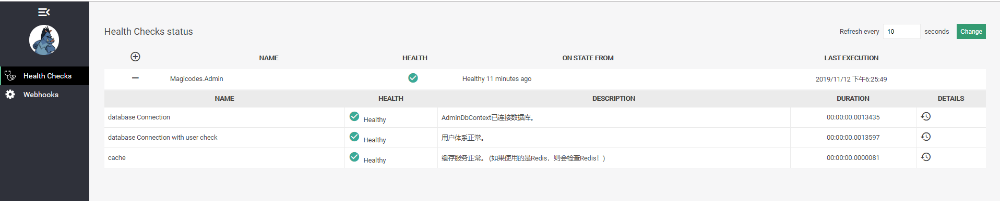
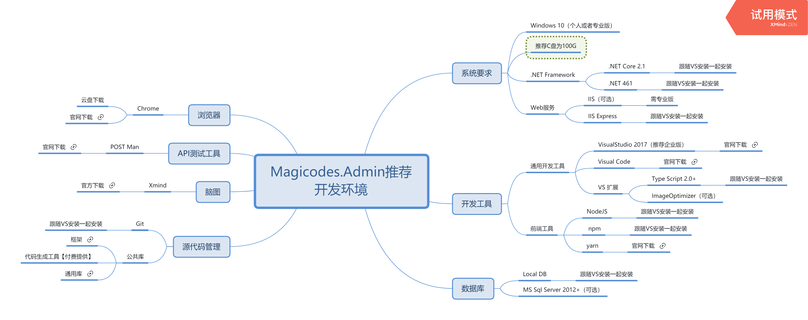

# Magicodes.Admin

<!--  -->
## 说明

Magicodes.Admin，是心莱科技团队打造的一套高效率、易扩展、基础设施强大、代码生成完备、理念和技术先进的敏捷开发框架，同时也是一套分布式、跨平台（**linux、Docker容器支持，已提供Docker教程、腾讯云容器托管教程、Azure DevOps教程**）、多终端（包括**Android、IOS、H5、小程序、微信公众号**）、前后端分离、持续集成（CI）、自动部署、监控支持的统一开发框架和开发解决方案。框架基于.NET Core 2.2、Angular、Ionic、EF Core、ABP和ASP.NET Zero，并在其基础上进行了封装和完善，并且编写了相关的工具（代码生成）、组件（云存储、支付、微信等等）、生成服务。

**注意：代码均开源免费，我方不收取任何授权费用。**

## 官方订阅号

关注“麦扣聊技术”订阅号获取：

* 最新文章、教程、文档
* 视频教程
* 解决方案
* 编程心得和理念

QQ群：85318032

## 官方文档

* 地址：<https://docs.xin-lai.com>
* 总体说明：<https://docs.xin-lai.com/2019/05/09/%E5%AE%98%E6%96%B9%E5%86%85%E5%AE%B9/%E6%80%BB%E4%BD%93%E8%AF%B4%E6%98%8E/>

## 免费的代码生成服务

* 在线免费生成服务地址（基本无限制，注册即可免费使用）：<https://cloud.xin-lai.com/>
  * 使用指南：<https://cloud.xin-lai.com/operate/guide>
  * 支持后台服务生成
  * 支持语言字典翻译和生成
  * 支持后台UI生成
  * 支持自动合并（需下载客户端合并工具）

由于服务器资源以及团队精力有限，目前已暂停服务。感谢TVP李文斌同学赞助了3台服务器，目前尚无精力部署k8s集群以及部署上线。

**正在准备抽取精力整理代码并开源，敬请期待。**

## 后台UI库

* Angular版本UI库地址：<https://gitee.com/magicodes/Magicodes.Admin.UI>
* Vue版本UI库地址（预计11月发布）：<https://gitee.com/magicodes/Ma-Vue>

## VNext

* 新版UI+Demo
* 后台Vue版本UI
* 具体见：<https://docs.xin-lai.com/2019/07/11/%E5%AE%98%E6%96%B9%E5%86%85%E5%AE%B9/%E9%BA%A6%E6%89%A3%E4%BA%A7%E5%93%81%E8%A7%84%E5%88%92/>

目前团队精力非常有限，仅能跟随项目情况进行更新。

## 相关Nuget包

| 名称     |      说明      |      Nuget      |
|----------|:-------------:|:-------------:|
| Magicodes.WeChat.MiniProgram |小程序SDK | |
| Magicodes.Sms.Aliyun |阿里云短信 |  |
| Magicodes.Storage.Core |通用存储核心库|  |
| Magicodes.Storage.AliyunOss.Core |阿里云OSS存储|  |
| Magicodes.Storage.Local.Core |本地存储|  |
| Magicodes.Storage.Tencent.Core |腾讯云存储|  |
| Magicodes.WeChat.SDK.Core |微信SDK |  |
| Magicodes.SwaggerUI |SwaggerUI API快速配置和分组|  |
| Magicodes.IE.Excel |Excel导入导出|  |
| Magicodes.IE.Core |导入导出核心库|  |
| Magicodes.IE.HTML | HTML导入导出| |
| Magicodes.IE.Pdf |Pdf导入导出|  |
| Magicodes.IE.Word |Word导入导出|  |
| Magicodes.Pay.Alipay  |支付宝支付库|   |
| Magicodes.Pay.Notify  |支付通用回调库|    |
| Magicodes.Pay.Wxpay  |微信支付库|   |
| Magicodes.Pay.Alipay.Global |国际支付宝支付库 |   |
| Magicodes.Pay.Allinpay  | 通联支付库 |  |
| Magicodes.Pay.Abp  | ABP 支付通用封装库|  |
| Magicodes.Pay.Abp.Allinpay  |ABP 通联支付模块|   |
| Magicodes.Pay.Abp.Wxpay  | ABP 微信支付模块|  |
| Magicodes.Pay.Alipay.Global  | ABP 国际支付宝模块 |   |
| Magicodes.Abp.Castle.NLog  | ABP Nlog支持模块 |   |
| Magicodes.WxMiniProgram.Sdk  |微信小程序SDK|   |
| Magicodes.WxMiniProgram.Sdk.Abp  |微信小程序SDK Abp模块|    |

相关源代码地址：
- <https://github.com/xin-lai>
- <https://gitee.com/magicodes>

## Docker镜像说明

Dockerfile已修改，基础镜像默认使用：ccr.ccs.tencentyun.com/magicodes/aspnetcore-runtime:2.2

该镜像GitHub地址：https://github.com/xin-lai/aspnetcore-docker

推荐理由：

* 使用国内公共镜像服务（腾讯云），拉取更快
* 默认包含时区设置、debian软件包加速以及libgdiplus等库的安装
* 如使用PDF组件，注意安装相关字体，具体参考Magicodes.IE.Pdf库的说明

## Demo

敬请期待新版UI。由于近期太忙，上线时间会推后。

## 开发组件、套件、解决方案、理念

目前框架中包含以下开发组件、套件、解决方案、理念：

* 通用功能权限
* 数据权限（框架中尚未提供Demo）
* 多租户
* 版本
* 组织机构
* 多语言
* 审计日志（操作审计和数据审计）
* 缓存管理（支持内存和Redis）
* 健康检查
	* 服务地址：http://localhost:5000/healthz
	* UI地址：http://localhost:5000/healthchecks-ui

* 日志（Log4net、**NLog**（https://github.com/xin-lai/Abp.Castle.NLog））
* 设置管理器
* **短信服务（Magicodes.Sms【https://github.com/xin-lai/Magicodes.Sms】）**
* **支付、统一支付回调（使用Magicodes.Pay【https://github.com/xin-lai/Magicodes.Pay】，支持微信、支付宝、国际支付宝支付和分账、通联支付等，已添加ABP模块封装）**
* **微信SDK（Magicodes.WeChat.SDK【https://github.com/xin-lai/Magicodes.WeChat.SDK】）**
* **微信模块，已完成公众号的配置，并且提供了公众号API Token获取和更新机制的封装，支持分布式架构**
* **小程序SDK（Magicodes.WxMiniProgram.Sdk【https://github.com/xin-lai/Magicodes.WxMiniProgram.Sdk】，逐步弃用【https://github.com/xin-lai/Magicodes.WeChat.SDK】）**
* **微信扫码登录（Magicodes.WeChat.SDK【https://github.com/xin-lai/Magicodes.WeChat.SDK】）**
* 通用异常处理
* **领域驱动**
* **依赖注入**
* **接口权限以及授权**
* **在线接口文档，支持配置文件快速配置，支持API分组和隐藏（Magicodes.SwaggerUI+Swagger UI【https://github.com/xin-lai/Magicodes.SwaggerUI】）**
* 数据验证
* 调度任务（Quartz）
* 后台任务（Hangfire）
* 数据筛选器（租户筛选器、软删除、是否激活）
* **跨平台以及Docker支持（目前基于.NET Core 2.2），支持Visual Studio Tools for Docker**
* 通知系统
* **支持通过配置文件配置Kestrel服务器（比如启用HTTPS，以便更好地支持Docker）**
* **支持HTTPS重定向**
* **支持HTTP严格传输安全协议(HSTS)**
  * 在浏览器将会阻止通过 HTTP 发送的任何通信的域的配置存储。 在浏览器强制通过 HTTPS 进行的所有通信。
  * 在浏览器可防止用户使用不受信任或无效的证书。 在浏览器禁用允许用户暂时信任此证书的提示。
* **即时消息（SignalR）支持，并且支持Redis集群**
* ORM和数据迁移(Entity Framework Core)
* **通用导入导出（Magicodes.IE【https://github.com/xin-lai/Magicodes.IE】），支持导出导出Excel、Pdf、HTML、Word以及数据验证和错误检查**
* **通用存储（Magicodes.Storage，支持本地存储,阿里云存储,腾讯云存储【https://github.com/xin-lai/Magicodes.Storage】）**
* 全国行政区域抓取和初始化（Magicodes.Districts【https://github.com/xin-lai/Magicodes.Districts】）
* **移动端统一开发解决方案和模板（Angular+Ionic）**
* 前后端分离
* **后台前端解决方案和UI（Angular、primeng、bootstrap）**
* **简单CMS**
* **移动端通用接口（登陆注册找回密码等）**
* 邮件服务
* **移动端多语言支持**
* **交易流水以及多国货币支持**
* **大量后台UI组件（除了常用组件，还支持Tree Table、图片展示、文件批量上传、枚举下拉、关联项下拉、审计）**
* 单元测试（后台服务、移动端服务）
* **代码生成（后台服务、后台UI功能、多语言定义、权限定义、移动端服务）**
* **一键部署（后台服务、前台服务、后台前端）**
* **接口调用代码生成（nswag，后台前端和移动端前端）**
* **支持Dapper，作为ORM辅助库**
* 应用服务基类
    * 增删改查
    * 导入
    * 生成导入模板
    * 下载导入错误的标注文件
    * 验证导入数据
    * 导出
    * 批量删除
    * 恢复数据
* 支持自定义异常转换器，见：AdminErrorInfoConverter

## 推荐开发环境

已升级到到.NET Core 2.2，请先下载SDK：<https://www.microsoft.com/net/download/windows>

## 文档官网&官方博客

- 文档官网：https://docs.xin-lai.com/
- 博客：http://www.cnblogs.com/codelove/

## 相关QQ群

编程交流群<85318032>

产品交流群<897857351>
